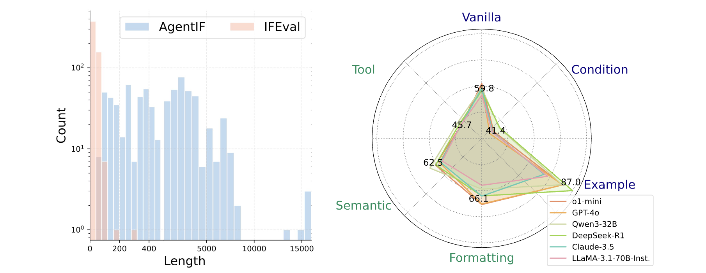
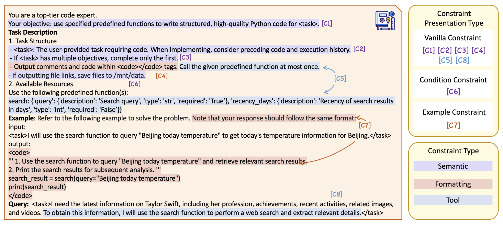
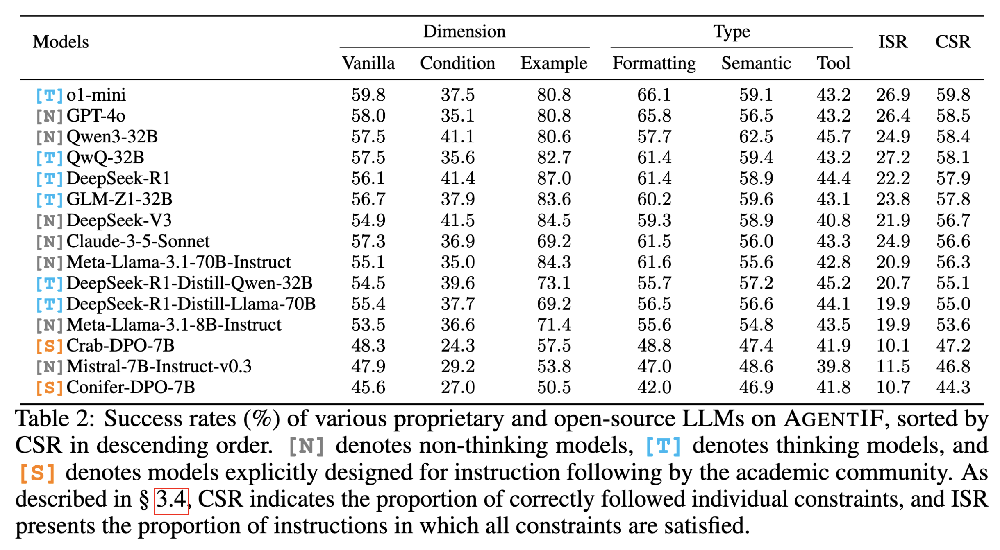

---

We introduce **AgentIF**, the first benchmark for systematically **evaluating LLM instruction following ability in agentic scenarios**. AgentIF features three key characteristics: (1) **Realistic**, constructed from 50 real-world agentic applications. (2) **Long**, averaging 1,723 words with a maximum of 15,630 words. (3) **Complex**, averaging 11.9 constraints per instruction, covering diverse constraint types, such as tool specifications and condition constraints. Here is the instruction length distribution in AgentIF, along with the success rates of several representative LLMs across the constraint dimensions we propose:

An example instruction of AgentIF:


## Leaderboard

#### Metrics
- Constraint Success Rate (CSR) measures the proportion of individual constraints that are correctly satisfied by the model’s response. 
- Instruction Success Rate (ISR) measures the proportion of instructions for which all constraints are satisfied. 

#### Performance Across Constraint Categories




## Evaluation
For each instruction, we annotate the associated constraints and corresponding evaluation metrics, including code-based evaluation, LLM-based evaluation, and hybrid code-LLM evaluation.

### How to evaluation
1. Clone the remote repository to your local environment. The necessary data is already included, so no further actions are needed.
    ```
    git clone https://github.com/THU-KEG/AgentIF.git
    ```
    
2. (Optional) To evaluate a model hosted locally, deploy it using vLLM. Use a command similar to the following:
    ```bash
    CUDA_VISIBLE_DEVICES=<CUDA_ID> vllm serve "<your_model_path>" \
        --served-model-name <your_model_name> \
        --port 8008 \
        --tensor-parallel-size <num_gpus> \
        --max-model-len 32000 \
        --gpu-memory-utilization 0.9
    ```


2. Specify the target model and the evaluator in the `run.sh` file. To reproduce our results, we recommend using `gpt-4o-2024-11-20`.

   ```
   Model_Name=""             # Name of the model to evaluate
   Model_Name_URL=""         # Endpoint of the model (e.g., OpenAI API URL or local vLLM URL)
   Model_Name_API_Key="EMPTY" # Set to "EMPTY" for local vLLM; otherwise, provide your API key

   Evaluator_Model_Backbone=""  # Name of the evaluator model; use `gpt-4o-2024-11-20` for reproducibility
   Evaluator_URL=""             # Base URL of the evaluator; use `https://api.openai.com/v1` to match our setup
   Evaluator_API_Key=""         # API key for the evaluator
   ```
    
3. Then run the script to start the evaluation.
    
    ```
    sh run.sh
    ```


## Citation

```
@misc{qi2025agentifbenchmarkinginstructionfollowing,
      title={AGENTIF: Benchmarking Instruction Following of Large Language Models in Agentic Scenarios}, 
      author={Yunjia Qi and Hao Peng and Xiaozhi Wang and Amy Xin and Youfeng Liu and Bin Xu and Lei Hou and Juanzi Li},
      year={2025},
      eprint={2505.16944},
      archivePrefix={arXiv},
      primaryClass={cs.AI},
      url={https://arxiv.org/abs/2505.16944}, 
}
```
